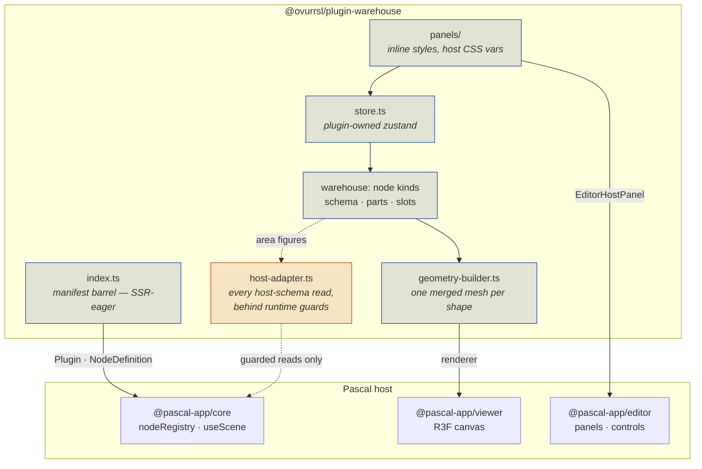

# @ovurrsl/plugin-warehouse

<!-- BADGES:START -->
[](https://github.com/ovurrsl/plugin-warehouse/actions/workflows/ci.yml)
[](https://github.com/ovurrsl/plugin-warehouse/actions/workflows/codeql.yml)


<!-- BADGES:END -->

Warehouse & logistics equipment for the [Pascal editor](https://editor.pascal.app) — pallets, racking, handling equipment, and a capacity readout.

Built against **plugin API v1** ([contract](https://editor.pascal.app/docs/developers/plugins)).

## Architecture

<!-- ARCH:START -->


Capacity figures come entirely from this plugin's own schemas, so a host change
cannot break them. Only the *area* figures cross the dashed line, and those
degrade to "no data" rather than throwing.
<!-- ARCH:END -->

## Design constraint: survive a host upgrade

This plugin is meant to keep working when it is dropped into a newer editor. That shapes what it is allowed to depend on:

| Layer | Examples | Treatment |
|---|---|---|
| **Contract** | `Plugin`, `NodeDefinition`, `EditorHostPanel`, `apiVersion` | Depend freely. Version-guarded — `loadPlugin` throws on a mismatch, so a break is loud. |
| **Non-contract exports** | `useScene`, `useEditor`, host UI controls | Import from package barrels only, never deep paths. |
| **Host node schemas** | `slab.polygon`, `level.children` | **Never read directly.** Everything goes through [`src/host-adapter.ts`](src/host-adapter.ts) behind runtime guards. |
| **Owned outright** | node schemas, geometry, capacity maths | Plugin-local. No host coupling. |

The split that matters: **capacity figures come entirely from this plugin's own node schemas**, so they cannot be broken by a host change. Only the *area* figures read host slabs, and those degrade to "no data" rather than throwing if the slab schema moves.

`src/compat.ts` prints one console block at panel mount naming which optional reads are live — so a host change reads as `❌ slab polygon — 0/7 readable` instead of an unexplained zero.

## Layout

```
src/
  index.ts          manifest barrel — SSR-eager, keep it thin
  plugin-id.ts      identity constants (PLUGIN_ID is persisted user data)
  host-adapter.ts   every host-schema read, behind runtime guards
  compat.ts         boot-time probe + console report
  catalog.ts        catalog data table (sections + items)
  store.ts          plugin-owned zustand: panel tab, stats scope
  panels/
    catalog-panel.tsx   the rail panel — Catalog / Stats tabs
```

## Conventions

- **Every dimension is metres.** Published warehouse specs are millimetres — divide by 1000. Never write a bare dimension literal greater than 100.
- `@pascal-app/*` are **peer** dependencies. A pinned copy creates a second `nodeRegistry` singleton and the kinds silently never resolve.
- Node kinds are namespaced `warehouse:`. Duplicate kinds warn in dev but **throw in production**.

## Installing into a Pascal host

The package is **self-contained** — its `tsconfig.json` extends nothing, its dependencies pin real versions, and it bundles no assets (panel icons are Iconify names the host resolves). It works identically as a monorepo workspace and as a git dependency, which is what lets it be developed here and shipped from its own repository without a rewrite.

Three edits in the host app:

**1. Depend on it**

```jsonc
// package.json — this repository is public, so the shorthand works
"@ovurrsl/plugin-warehouse": "github:ovurrsl/plugin-warehouse#<commit-sha>"
// …inside the editor monorepo: "*"
// …if you make your fork private, see the note below
```

Pin a commit SHA rather than a branch. A branch pin means `bun install` can
change the plugin under a host that did not ask for it, and the symptom — a
kind that used to register and now does not — points at the host.

> **`github:` does not work for a *private* repository**, which is worth
> recording because the failure names the wrong thing. Bun resolves that
> shorthand through `api.github.com/repos/.../tarball/…` and fetches it
> unauthenticated, so a private repo answers `404` and the install fails with
> `failed to resolve`. Bun 1.3 has no token setting that changes this —
> `GITHUB_TOKEN`, `GH_TOKEN`, `BUN_CONFIG_TOKEN`, `BUN_AUTH_TOKEN`,
> `NPM_CONFIG_TOKEN` and `~/.netrc` were each verified to make no difference,
> and `git+https://github.com/…` is rewritten to the same tarball URL.
>
> The `git+ssh://git@github.com/owner/repo.git#<sha>` form is what makes bun
> shell out to `git` instead, and git authenticates the way it already does for
> `push` — through the credential helper. On a machine where `git push` works
> this installs with no extra setup and **no SSH key is required**, despite the
> scheme name.

**2. Transpile it** — the package ships TypeScript source, not built JS:

```ts
// next.config.ts
transpilePackages: ['@ovurrsl/plugin-warehouse', /* … */]
```

**3. Register it, before the bootstrap kicks off discovery**

```ts
import { warehouseCatalogPanel, warehousePlugin } from '@ovurrsl/plugin-warehouse'

extendPluginDiscovery(async () => [warehousePlugin])
registerEditorHostPanel(warehouseCatalogPanel)
```

Use `extendPluginDiscovery`, never `setPluginDiscovery` — the latter replaces the whole chain and silently drops every other plugin.

> **This requires a host you can edit.** Plugin API v1 has no URL-manifest loader: discovery is a function somebody has to call, and the bootstrap module is the only call site. So the plugin drops into your own build or fork of the editor, but not into a hosted editor whose source you do not control.

## Known host limitation: duplicating plugin nodes

`packages/editor/src/lib/scene-clipboard.ts` validates clipboard nodes with `AnyNode.parse`. `AnyNode` is the host's hand-maintained union of built-in kinds, so a plugin-contributed kind can never be a member of it — the registry validates those against `def.schema` at runtime instead. The result: **`capabilities.duplicable` cannot be honoured for any plugin**, including the first-party `pascal:trees` pack, which declares it and fails identically.

Nothing in the plugin API works around it. `DuplicableConfig` exposes only `subtree` and `prepareSubtreeClone`, and both run *after* the parse that throws.

The host needs a fallback to the registry schema, at both call sites (the `remapNodeReferences` return, and the system-clipboard parse in `readClipboardPayload`):

```ts
function parseClipboardNode(candidate: unknown): AnyNode {
  const builtin = AnyNode.safeParse(candidate)
  if (builtin.success) return builtin.data
  const type = (candidate as { type?: unknown } | null)?.type
  const definition = typeof type === 'string' ? nodeRegistry.get(type) : undefined
  if (definition) return definition.schema.parse(candidate) as AnyNode
  throw builtin.error
}
```

Built-in behaviour is unchanged — `AnyNode` is tried first — and an unknown type still raises the original error.

Submitted upstream as [pascalorg/editor#547](https://github.com/pascalorg/editor/pull/547), with a test that registers a definition the way a plugin does and fails without the fallback.

> **Until that lands it is a local patch to the host checkout.** It is not part of this package and does not travel with it: pulling a newer editor reverts it and duplicate silently starts failing again — with the error pointing at the plugin, so anyone debugging it without this note looks in the wrong place.

## Extracting to a standalone repository

The package is written to make this a copy, not a port:

```sh
cp -r packages/plugin-warehouse ../plugin-warehouse
cd ../plugin-warehouse && git init && bun install
bun run check-types && bun test
```

Nothing needs editing. `.github/workflows/ci.yml` is inert inside the monorepo (GitHub only reads workflows from a repo root) and starts running on the first push.

Then point the host at the new repo by swapping the dependency to the git URL from step 1.

To keep it extractable, four rules hold for anything added here:

- **Import from package barrels only** — `@pascal-app/core`, never `@pascal-app/core/src/...`. Deep paths are outside the `exports` map and break on the first release.
- **No workspace-only dependencies** — nothing resolved by `"*"` or by a path inside the editor monorepo.
- **No host assets.** `/icons/shelf.webp` exists in the editor app's `public/`, not in a consumer's. Icons are Iconify names; anything else must be bundled or inlined.
- **No Tailwind classes in panel markup.** Panels style themselves with inline styles resolving the host's own CSS variables (`src/panels/styles.ts`), which is why installing needs no `@source` line. Tailwind v4 does not scan symlinked directories, and a git dependency is *always* a symlink into bun's store — so a utility class written here is silently never compiled. There is no error; the panel simply renders unstyled. Verified both ways: pointing `@source` at the store's real path emits the class, pointing it at the symlink emits nothing, and neither a `**/*` glob nor `bun install --backend=copyfile` changes it. The first-party `plugin-trees` pack has the same problem.

## Verifying

In dev the console prints:

```
[pascal:registry] + N discovered plugin(s)
[ovurrsl:warehouse] host compatibility ✅
```

That is the anchor. If those lines are missing, fix the wiring before debugging anything else.

## Scripts

```sh
bun run check-types                 # tsc --noEmit
bun test                            # bun's runner
bunx biome check .                  # lint + format, `--write` to fix
bun run scripts/update-readme.mjs   # regenerate the blocks below
bunx git-cliff --output CHANGELOG.md
```

## Recent changes

<!-- CHANGELOG:START -->
## Unreleased


### Build and CI

- Drop npm version updates — Dependabot cannot maintain bun.lock ([`9e9e849`](https://github.com/ovurrsl/plugin-warehouse/commit/9e9e849910c5b4bdce037ec6f5617860f468b824))
- CI, CodeQL, changelog automation and repo scaffolding ([`a5f6e2b`](https://github.com/ovurrsl/plugin-warehouse/commit/a5f6e2bc0b941a7885a726477374f045d6176d3f))

### Chores

- Obsidian gitignore girdilerini geri al ([`e80016a`](https://github.com/ovurrsl/plugin-warehouse/commit/e80016a9dd165ed0bcedc01a9832f5b493834b5b))
- Obsidian kasasını ve yerel notları gitignore'a al ([`c54aaf5`](https://github.com/ovurrsl/plugin-warehouse/commit/c54aaf59ed19ee8e3cd7c8bcac055090ba0e6b98))

### Documentation

- Refresh generated README blocks [skip ci] ([`e7f62bc`](https://github.com/ovurrsl/plugin-warehouse/commit/e7f62bc61907114a61706d946321fbc4af501705))
- Refresh generated README blocks [skip ci] ([`cb05e0a`](https://github.com/ovurrsl/plugin-warehouse/commit/cb05e0ae7d8f0c325d898dcfde8db5ba852b6302))
- Refresh generated README blocks [skip ci] ([`faf7735`](https://github.com/ovurrsl/plugin-warehouse/commit/faf77351aa1067429b03c6a5c4679f2240290713))
- Refresh generated README blocks [skip ci] ([`bfb0d05`](https://github.com/ovurrsl/plugin-warehouse/commit/bfb0d055da79bb71bfb4f214faf6238315f84ef3))
- Refresh generated README blocks [skip ci] ([`4697fdd`](https://github.com/ovurrsl/plugin-warehouse/commit/4697fdd338982d8da5e5d1383c6dc1e8ea4055f6))
- Refresh generated README blocks [skip ci] ([`b519c72`](https://github.com/ovurrsl/plugin-warehouse/commit/b519c72fc1eeac406433bd454d0cf502c879d08f))
- Refresh generated README blocks [skip ci] ([`7326461`](https://github.com/ovurrsl/plugin-warehouse/commit/7326461c64866b919c8851e69c19fb7a189f1758))
- Refresh generated README blocks [skip ci] ([`a70a3bd`](https://github.com/ovurrsl/plugin-warehouse/commit/a70a3bd66b5a07461767f37a8c3ca5df117f7809))
- Refresh generated README blocks [skip ci] ([`f857537`](https://github.com/ovurrsl/plugin-warehouse/commit/f8575371ad1af416cfc44b7985a33e87cea546d9))

…

Full history in [CHANGELOG.md](CHANGELOG.md).
<!-- CHANGELOG:END -->
